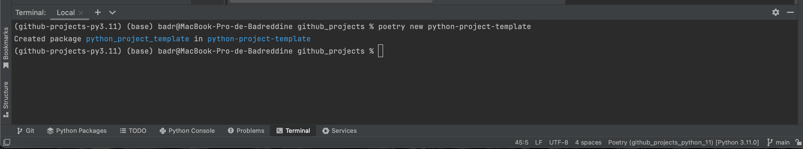

# Poetry installation
## Motivation
This reason of using [Poetry](https://python-poetry.org/) instead of pip to manage dependencies since Poetry allows you to:

-   Separate the main dependencies and the sub-dependencies into two separate files (instead of storing all dependencies in `requirements.txt`)
-   Create readable dependencies files
-   Remove all unused sub-dependencies when removing a library
-   Avoid installing new packages that are conflict with the existing packages
-   Package your project in several lines of code

Find the instruction on how to install Poetry [here](https://python-poetry.org/docs/#installation) or simply follow the steps enumerated below. All main dependencies for this project are specified in `pyproject.toml`.


## Installation for macos:
### [Install](https://python-poetry.org/docs/#installation) poetry:
Open a terminal and execute:
```bash
curl -sSL https://install.python-poetry.org | python3 -
```
To test poetry is correctly installed or no, you need to execute:
```bash
poetry -V
```
### Add poetry bin path to PATH
Depending on the macOS version you’re running on your Mac, this can be done via either the bash shell or zsh (z shell).

* For older macOS versions (before Catalina): bash (.bashrc or .bash_profile)
* For macOS Catalina and later: zsh (.zshrc or .zsh_profile)

To add the path you need to open a terminal and execute:

```bash
vim ~/.zshrc
```
Then type ```i```.

Then you go to an empty line and paste:
```
export PATH=$PATH:$HOME/.local/bin
```
Then press ```Esc```, then write ```:wq``` and press ```enter```

Then immediately write the following command line apply the changes immediately.

```bash
source ~/.zshrc
```
Then you will be able to use poetry:
```bash
poetry -V
```
It will return something like this:
```
Poetry (version 1.2.2)
```

### Create new python project using poetry
* Open the terminal and change the current working directory to your local project.
* Create the project folder using poetry:
```
poetry new python-project-template
```


### Add a new PyPI library:

 ```bash
poetry add <library-name>
```

### Remove a library:

```bash
poetry remove <library-name>
```